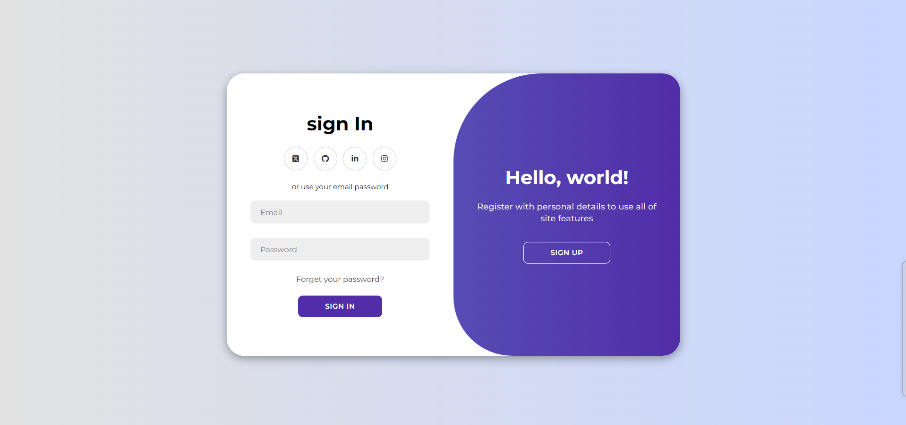

# ✍️ Form Validation in JavaScript 

Simple client-side form validation. Check required, length, email, and password

**Built with HTML, CSS and JavaScript.**

## Project Specifications

## Normal View

## Error

## Success

